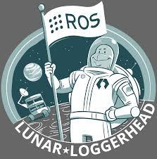
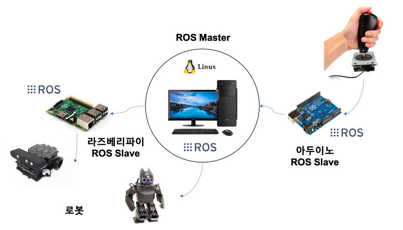
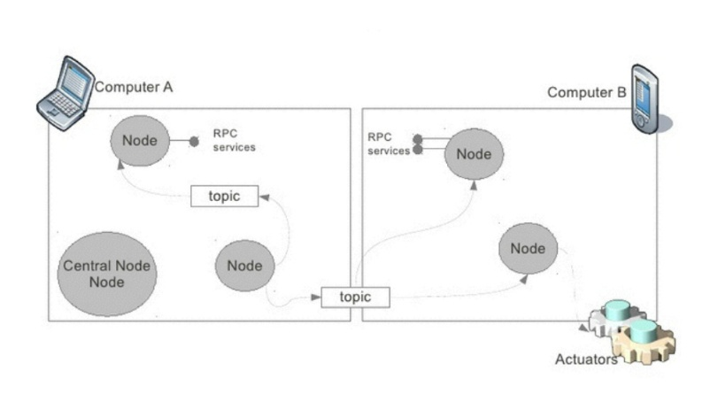
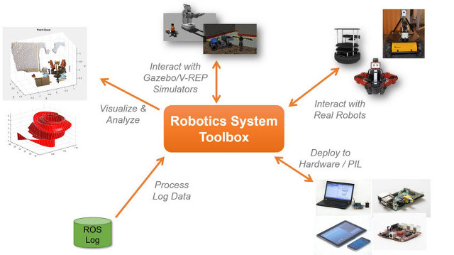
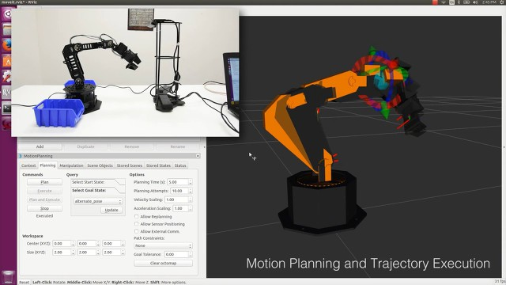

# 로봇개발도구모음 ROS

ROS 는 로봇용 공개소스 메타 운영체제입니다. 
ROS는 일반 운영체제에서 제공하는 하드웨어 추상화, 저수준 기기 제어, 빈번히 사용되는 기능들이 구현되어 있으며 프로세스간 메시지 전달, 패키지 관리 기능 등을 제공합니다. 
또한, ROS는 여러 컴퓨터 시스템 작동하는 코드를 얻어오고, 빌드하고, 작성하고 실행하기 위한 도구 및 라이브러리를 제공합니다. 

ROS는 언제 어떻게 써야할까요?
--
이제 막 로봇에 입문한 분, 아두이노로 나의 로봇을 만들어보았는데 그 이상으로 개발을 해보고 싶으신 분을 위해 작성되었습니다.
대부분 로봇개발에 입문하게되면 '아두이노'를 이용하여 LED나 서보모터를 제어하는 법을 배웁니다. 

나만의 RC카를 만들어 블루투스로 조종을 하게된다면 어느덧 훌륭한 로봇개발자로 거듭나게됩니다. 마이크로 컨트롤러(안드로이드)의 I/O핀을 읽고 제어할 줄 알고 제어를 위한 프로그래밍을 할 수 있게된다면 그 다음 스텝으로 성장하고 싶은 갈증을 느끼게 됩니다.

플레이스테이션 컨트롤러(블루투스 조종기)가 아닌 나의 컴퓨터에서 로봇을 조종해보고 싶고 내가 조종하는 명령으로 움직이는 로봇이 아닌, 카메라로 사람을 인식하여 쫓아가는 로봇 등 을 만들고 싶다면 그때 바로 ROS의 도움을 받아 로봇 개발을 시작하면 됩니다.

한 가지 예를 들자면, 우리가 일상생활 속에서 사용하는 스마트폰은 수 많은 제조사에서 개발되어 판매되고 있습니다. 
각기다른 모양, 버튼 수, 카메라 스펙 등 하드웨어의 특징이 다르지만 우리는 '안드로이드', 'ISO' 등의 도움으로 동일한 사용방법으로 스마트폰을 이용하고 있습니다.

하드웨어를 손 쉽게 사용하게 도와준다.
--
각기다른 하드웨어(아두이노, 라즈베리파이, 노트북, 스마트폰)에서 동일한 사용(개발)방법을 제공하기 위한 도구(Tool)라 보시면 됩니다. 
- 라즈베리파이에 ROS패키지를 설치
- 아두이노에 ROS 헤더파일을 추가
- 컴퓨터에 ROS를 빌드

ROS Tool을 자신이 가지고 있는 하드웨어에 설치하거나 연동을 하면 하드웨어의 특징을 몰라도 손 쉽게 로봇을 만들 수 있습니다. 

>출처 https://www.slideshare.net/ArnoldBail/robotics-and-ros

ROS는 OS일까요?
--
우리는 라즈베리파이를 사용하기위해 라즈베리안이란 OS를 설치합니다. 노트북을 사용하기 위해서 윈도우나 리눅스를 설치합니다.
ROS를 처음 접하게되면 'OS'란 글자로 인해 우리가 흔히 알고있던 OS와 헤깔리게 됩니다. ROS는 '메타운영체제' 입니다.  ROS는 내가 설치한 윈도우나 리눅스위에 설치하게되며 기존 OS의 자원을 이용하여 로봇을 개발 할 수 있는Tool을 제공하게 됩니다. 

한 가지 예를 들자면, 우리가 컴퓨터 작업 중 자주 사용하는 프로그램 중 하나인 엑셀을 보겠습니다. 엑셀은 윈도우PC, 리눅스 PC, 맥 등 각기다른 OS에서 설치하고 사용할 수 있습니다. 사용자는 설치버튼만 누르면 간단하게 설치할 수 있죠. 

각 OS의 특징을 알아야하거나 셋팅을 바꿀 필요가 없습니다.ROS도 엑셀처럼 각 OS위에 설치하게되면 각 OS의 특징을 몰라도 손쉽게 ROS에서 제공하는 기능을 사용할 수 있습니다.

ROS = 로봇개발도구모음
--
ROS(로봇개발도구)에서 제공하는 기능은 무엇이 있을까요?
- 로봇 간 통신을 쉽게 사용할 수 있는 인터페이스
- 모터 및 센서를 쉽게 사용할 수 있는 패키지
- 로봇 시뮬레이터 및 개발을 쉽게 도와주는 GUI 프로그램 

> 출처 https://www.businesswire.com/news/home/20150414005916/en/MathWorks-Introduces-Robotics-System-Toolbox-Complete-Integration

ROS를 나의 컴퓨터나 라즈베리파이에 설치하게되면 ROS에서 제공하는 통신 라이브러리를 사용할 수 있습니다. 
예를들면 아두이노에서 시리얼 라이브러리를 사용하면 손쉽게 로봇과 컴퓨터 통신이 가능하죠? ROS도 메시지 전달 인터페이스를 활용하면 로봇과 컴퓨터, 로봇과 로봇간의 쉬운 통신을 사용할 수 있습니다.

삼성, LG등 스마트폰 제조회사가 안드로이드를 위한 스마트폰을 만들고 판매하고 있습니다. ROS도 마찬가지로 ROS를 쉽게 연동할 수 있게 하드웨어를 만들어 판매하는 제조회사가 늘어나고 있습니다. Intel의 리얼센스카메라, 로보티즈의 다이나믹셀 등 ROS를 사용법을 숙지하게 된다면 다양한 하드웨어를 쉽게 사용할 수 있습니다. 한가지 예를들어 우리가 아두이노로 DC모터를 제어할 때 우리는 아두이노의 핀번호를 확인하고 DC모터 드라이버를 위한 프로그래밍을 모두 해주었습니다. 

> 출처 https://www.youtube.com/watch?v=NTrmUOY083Y

하지만 ROS를 사용하면 모터드라이브, I/O정보를 모르더라도 "1번 서보모터 동작!" 이란 명령만 내리면 쉽게 사용할 수 있습니다.
로봇은 실제세상에서 움직이는 기계장치입니다. 즉 SW프로그래밍 뿐만아닌 HW의 테스트 및 검증이 필요합니다. 하지만 시간과 장소 그리고 비용이 발생하기에 실제 환경에서 개발 및 테스트는 쉽지 않습니다. 

ROS는 로봇시뮬레이터를 제공합니다. 내가만든 코드를 가상의 로봇에 적용하여 실시간으로 테스트하고 확인해 볼 수 있습니다. 

ROS참고자료
--
- [COSCUP 2016  ROS 발표자료](https://www.slideshare.net/ssuser54fe9a/coscup-2016-ros-gazebo)
- [ROS 세미나, 표윤석박사 정리자료](https://github.com/robotpilot/ros-seminar)
- [ROS distributed architecture](https://www.slideshare.net/pibgeus/21-distributed-architecture-deploymentinstrospection)
